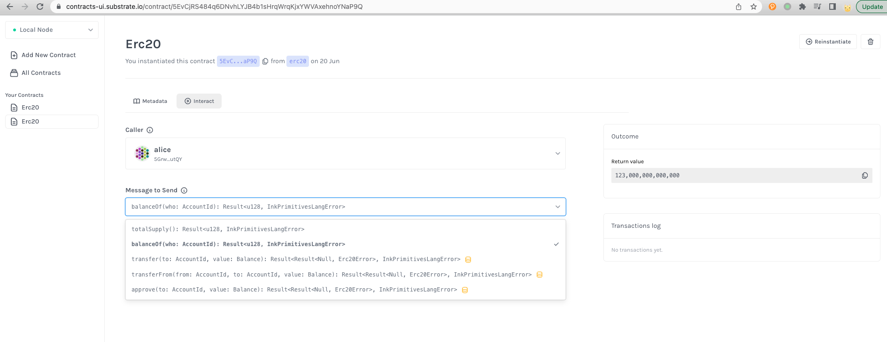
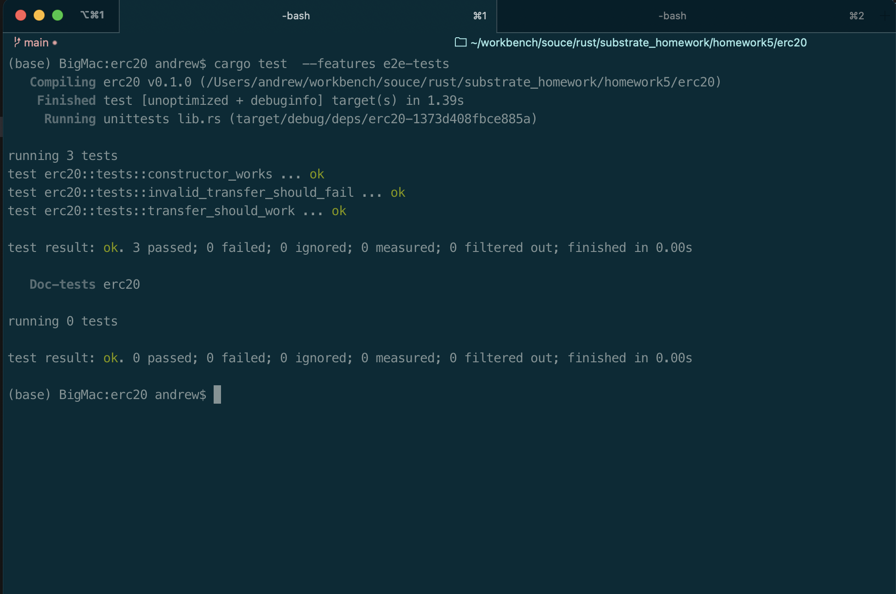

# contract

* 创建合约

~~~shell
cargo contract new erc20
~~~

* 编译合约

~~~shell
cargo contract build
~~~

* 启动节点

~~~shell
target/release/substrate-contracts-node --dev --tmp
~~~

* 编写单元测试

* 安装 cargo-expand

~~~shell
cargo install cargo-expand
~~~

* 生成 out.rs文件

~~~shell
cargo expand --lib > out.rs
~~~

* 运行单元测试

~~~shell
export CONTRACTS_NODE=/Users/andrew/workbench/souce/rust/substrate-contracts-node/target/release/substrate-contracts-node
cargo test --release --features e2e-tests
~~~

* 新合约

~~~shell
cargo contract new trait_erc20
~~~